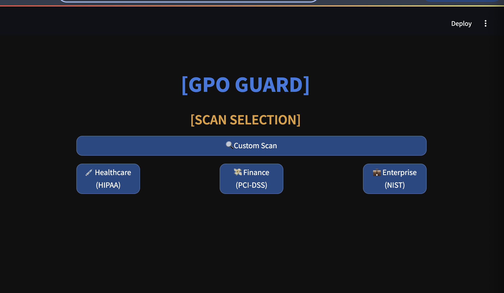
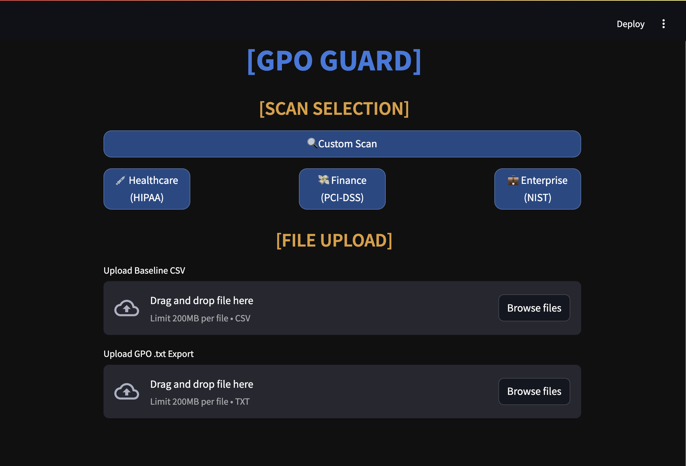
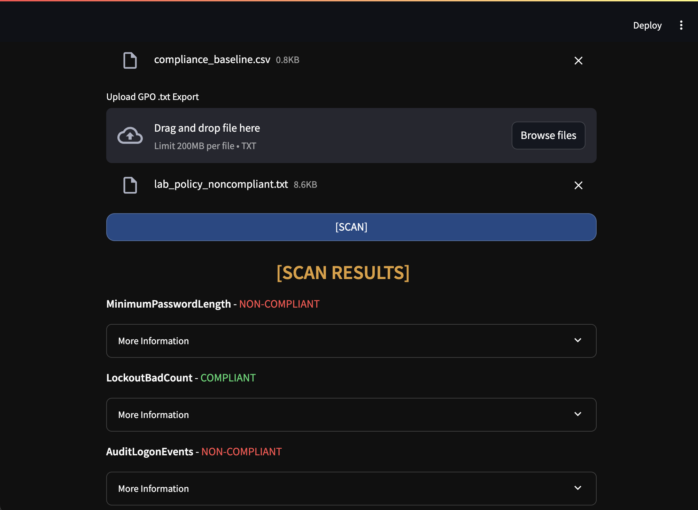
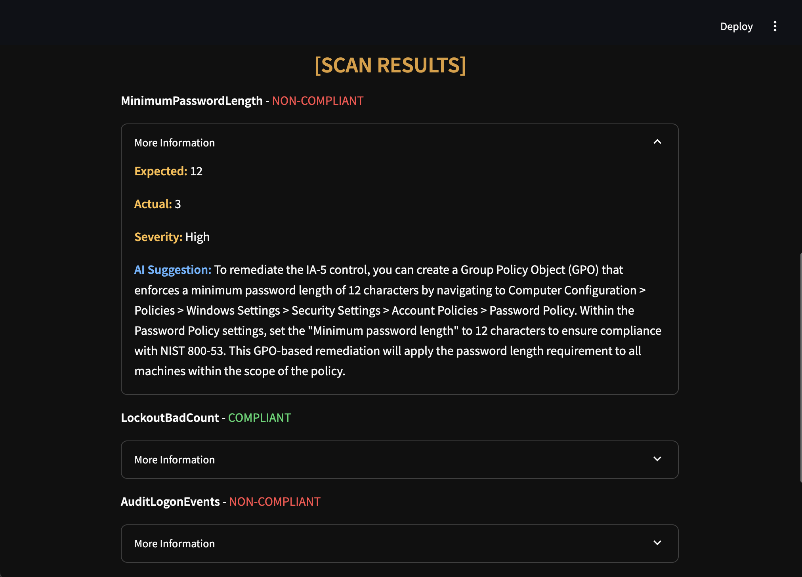
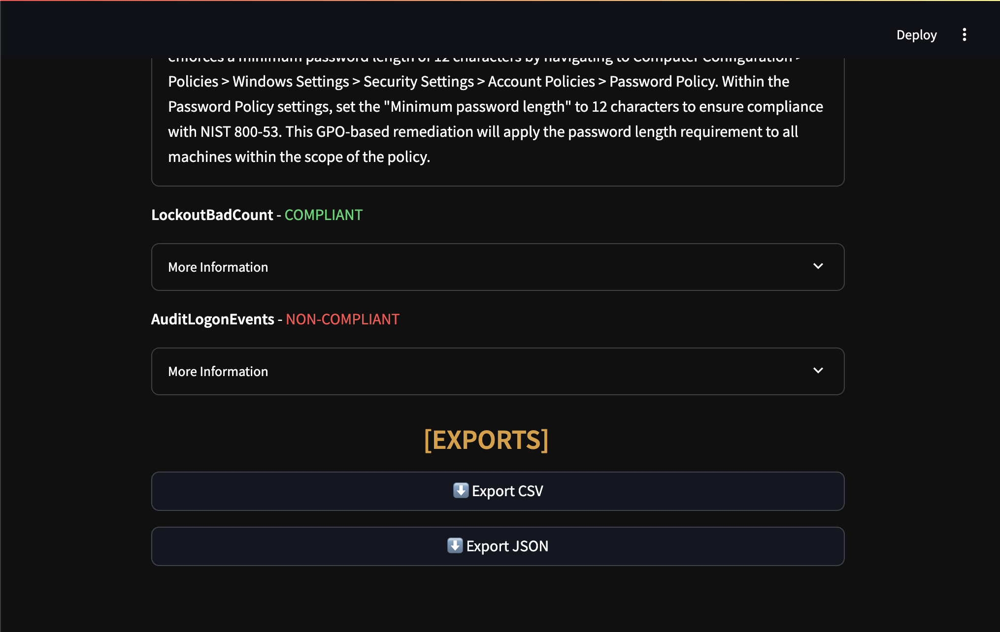
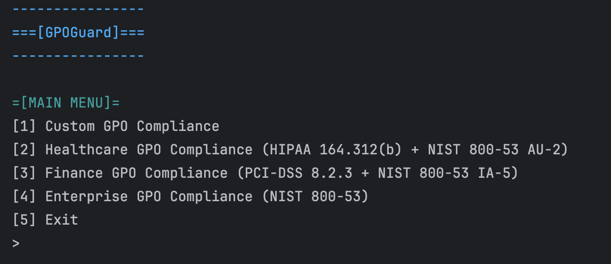
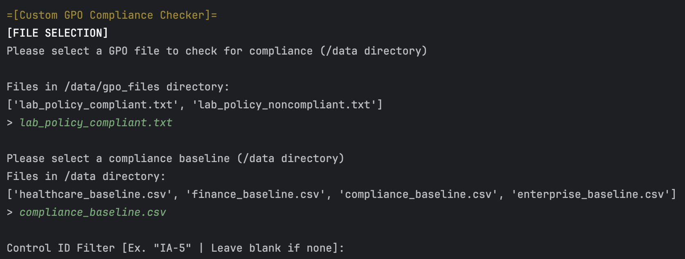
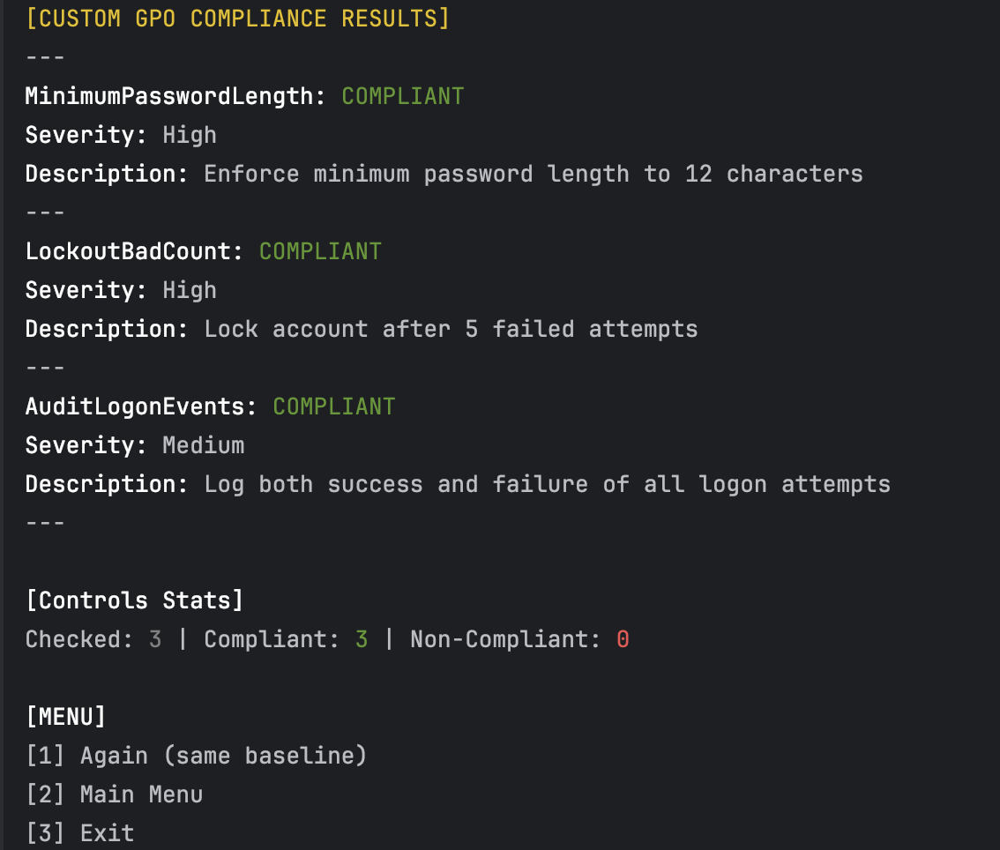
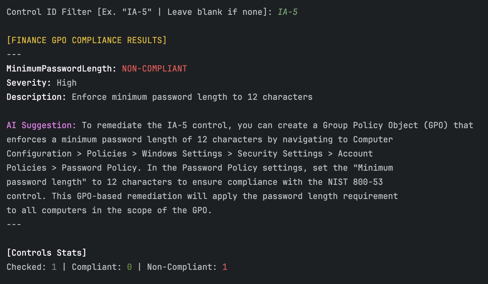

# 🔐 GPOGuard – Group Policy Compliance Auditor w/ AI

**GPOGuard** is a tool that audits AD GPO exports against compliance baselines like **HIPAA**, **PCI-DSS**, and **NIST 800-53**. It has both **Streamlit GUI** and a fully functional **Colorama CLI**, making it versatile for enterprise, educational, and personal security projects. I started building it using my Active Directory Lab by exporting my lab policy setup infomration to compare against various baselines. 

> Built to automate audit workflows and remediation procedures, with GROQ AI-generated recommendations.

---

## 📷 UI Preview

### Web App (Streamlit)



### Console UI (Colorama)


Python CLI tool for auto GPO compliance checks. Supports custom imported baselines as well pre-made industry specific baselines such as:
- **Healthcare** (HIPAA 164.312(b) + NIST 800‑53 AU‑2)  
- **Finance** (PCI‑DSS 8.2.3 + NIST 800‑53 IA‑5)  
- **Enterprise** (NIST 800‑53)

---
## Features
### Capabilities
- Custom or prebuilt baseline compliance scans
- HIPAA + NIST baseline (Healthcare)
- PCI-DSS + NIST IA-5 baseline (Finance)
- NIST 800-53 full baseline (Enterprise)
- AI-generated remediation suggestions
- File uploads via GUI (GPO & Baseline)
- Export results to **CSV** and **JSON**
- Control ID filtering (via CLI)
- Color-coded terminal UI via **Colorama**
- Modular design for scaling and new features
- UI powered by **Streamlit**

---

## UI Modes
### 1. Streamlit Web App (GUI)
- Drag and drop uploads
- Button-based framework selection
- Scan results (severity, status, AI suggestions)
- Export buttons (CSV, JSON)
- Dark themed
## Screenshots







### 2. Console UI
- Colorama-powered CLI interface
- Interactive menu options
- Live scanning feedback
- Optional Control ID filtering
- Logs results to CSV and JSON
## Screenshots






---

## Requirements
```pip install -r requirements.txt```

## AI Integration 
The ```AIEngine.py``` module supports contextual, control-specific fix suggestions. If you configure an API key for GROQ, GPOGuard can generate automated remediation advice.

